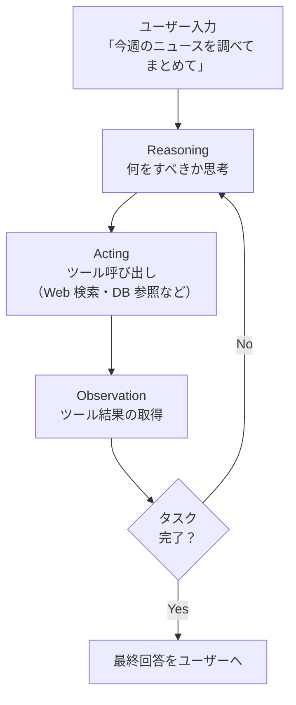
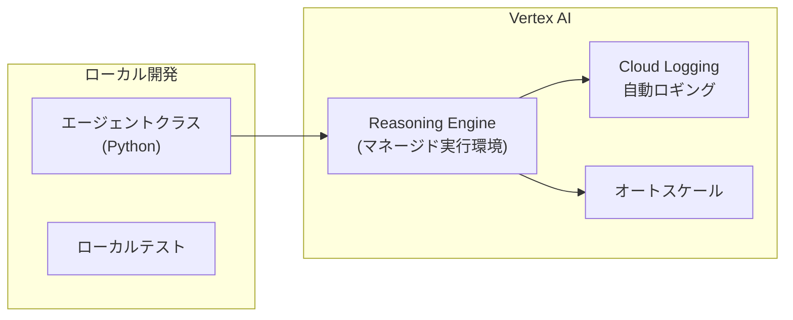
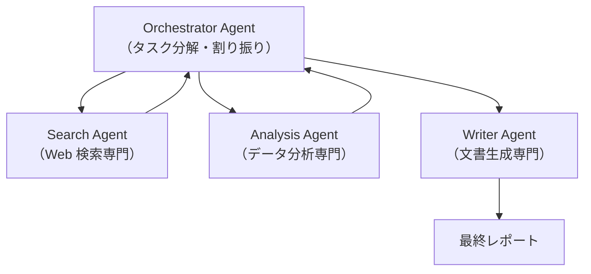

# Agents & Reasoning Engine（エージェント構築と Agent Platform）

## なぜ「エージェント」が必要なのか？

単発の generate_content では **「計画→実行→観察→再計画」** のループが作れない。
エージェントは LLM に「次に何をすべきか」を繰り返し判断させることで、
人間が逐一指示しなくても複雑なタスクを自律完了できるようにする。

| 設計判断 | 理由 |
|---------|------|
| **ReAct ループを基本パターンに** | Reasoning と Acting を交互に繰り返すことで LLM の思考が行動に結びつくため |
| **Reasoning Engine をマネージドサービスに** | スケーリング・ロギング・セキュリティをユーザーが実装しなくて済むため |
| **LangChain / LlamaIndex と統合** | 既存エコシステムの資産を活かしながら Vertex AI の管理機能を追加するため |

---

## エージェントの動作原理（ReAct ループ）



---

## DIY ReAct エージェント（最小実装）

`gemini/function-calling/intro_diy_react_agent.ipynb` のパターン：

```python
from vertexai.generative_models import GenerativeModel, Tool

def run_react_agent(user_query: str, tools: list, max_iterations: int = 5):
    model = GenerativeModel("gemini-2.0-flash-001", tools=tools)
    chat = model.start_chat()
    response = chat.send_message(user_query)

    for _ in range(max_iterations):
        parts = response.candidates[0].content.parts

        # Function Call が含まれていなければ完了
        function_calls = [p for p in parts if p.function_call]
        if not function_calls:
            break

        # ツールを実行して結果を返す
        tool_results = [execute_tool(fc.function_call) for fc in function_calls]
        response = chat.send_message(tool_results)

    return response.text
```

---

## Reasoning Engine（Vertex AI マネージドエージェント）

Agent Platform の中核サービス。エージェントを **コンテナとしてデプロイ・管理** できる。



### デプロイ手順

```python
import vertexai
from vertexai.preview import reasoning_engines

vertexai.init(project="my-project", location="us-central1",
              staging_bucket="gs://my-bucket")

class MyAgent(reasoning_engines.Queryable):
    def set_up(self):
        # 初期化（モデル・ツールの準備）
        self.model = GenerativeModel("gemini-2.0-flash-001")
    
    def query(self, *, input: str) -> str:
        # エージェントのメインロジック
        return self.model.generate_content(input).text

# デプロイ（数分かかる）
remote_agent = reasoning_engines.ReasoningEngine.create(
    MyAgent(),
    requirements=["google-cloud-aiplatform>=1.38"],
    display_name="my-agent",
)

# デプロイ済みエージェントに問い合わせ
result = remote_agent.query(input="質問をどうぞ")
```

---

## マルチエージェント構成

`gemini/agents/research-multi-agents/` のパターン：
複数の専門エージェントが協調してタスクを分担する。



---

## Always-On Memory Agent

`gemini/agents/always-on-memory-agent/` のパターン：
ユーザーとの会話を記憶し、次回会話に引き継ぐ。

| コンポーネント | 役割 |
|-------------|------|
| **短期記憶** | 会話履歴（Chat.history） |
| **長期記憶** | Cloud Firestore / Bigtable に永続化 |
| **記憶検索** | Embeddings + Vector Search で関連記憶を取得 |

```python
# 長期記憶のパターン
class MemoryAgent:
    def __init__(self):
        self.vector_store = VertexAIVectorStore(...)  # 長期記憶
        self.chat = model.start_chat()                # 短期記憶

    def chat_with_memory(self, user_input: str) -> str:
        # 関連する過去の記憶を検索
        memories = self.vector_store.similarity_search(user_input, k=3)
        context = "\n".join([m.page_content for m in memories])

        # 記憶をコンテキストとして注入
        response = self.chat.send_message(
            f"過去の会話:\n{context}\n\nユーザー: {user_input}"
        )

        # 今回の会話を長期記憶に保存
        self.vector_store.add_texts([f"Q: {user_input}\nA: {response.text}"])
        return response.text
```

---

## Agent Platform vs 自前実装 の選択基準

| 要件 | 推奨 |
|-----|------|
| 学習・プロトタイプ | DIY ReAct（Notebook） |
| 本番・スケール必要 | Reasoning Engine |
| 複雑なワークフロー | Agent Platform（別リポジトリ） |
| 既存 LangChain 資産あり | Reasoning Engine + LangChain |
| オンプレ・VPC 制約あり | Vertex AI Private Service Connect |
