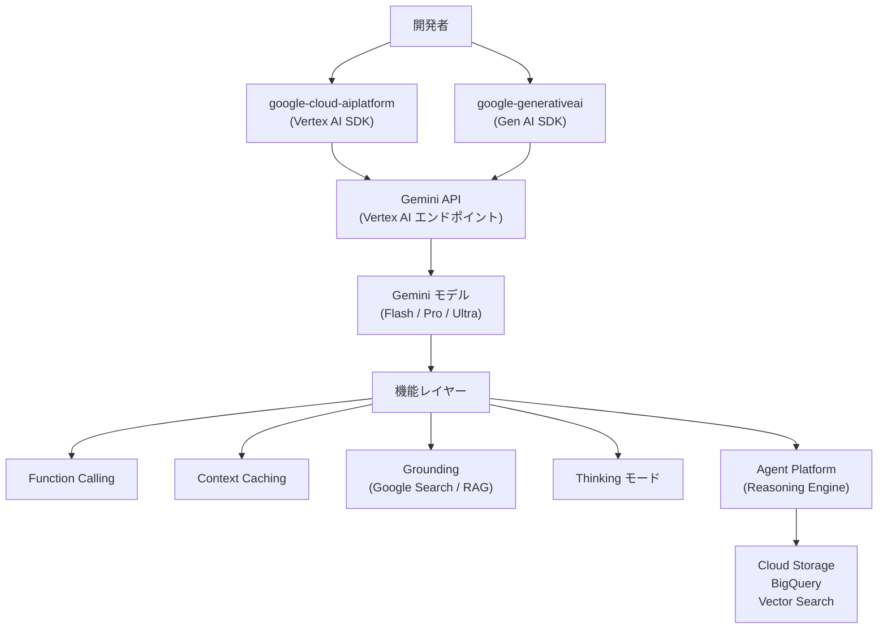
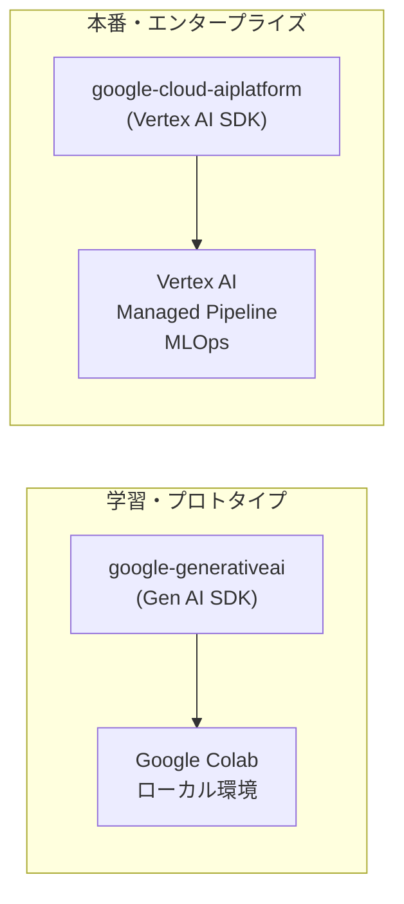

# Gemini on Google Cloud アーキテクチャ全体像

## なぜこのリポジトリはこの構造を選んだのか？

Google Cloud の生成 AI は **「モデル × 機能 × 実行環境」** の3軸で構成される。
ユーザーは用途に応じて SDK・API・Agent Platform を組み合わせるため、
リポジトリもその3軸に沿ってディレクトリが分かれている。

| 設計判断 | 理由 |
|---------|------|
| **Notebook（.ipynb）中心** | 実験・学習フェーズでは再現性より試行速度が優先されるため |
| **Vertex AI と Gen AI SDK の2経路** | Vertex AI は本番 MLOps 統合、Gen AI SDK は軽量スクリプト向けと住み分け |
| **Agent Platform を別リポジトリ** | エージェント基盤は独立したライフサイクルを持つため切り出し |

---

## 全体構成

---

## ディレクトリ構成と役割

| ディレクトリ | 内容 | 対応 SDK |
|------------|------|---------|
| `gemini/` | Gemini 機能のノートブック群（最重要） | 両方 |
| `gemini/getting-started/` | モデル別イントロ（Flash/Pro/Ultra） | 両方 |
| `gemini/function-calling/` | Function Calling の各パターン | 両方 |
| `gemini/agents/` | エージェント構築サンプル | Vertex AI SDK |
| `gemini/thinking/` | Thinking モード（思考署名） | 両方 |
| `gemini/context-caching/` | コンテキストキャッシュ | 両方 |
| `gemini/grounding/` | Google Search グラウンディング | Vertex AI SDK |
| `rag-grounding/` | RAG パターン集（インデックス） | Vertex AI SDK |
| `agents/` | 本格エージェントサンプルアプリ | Vertex AI SDK |
| `embeddings/` | テキスト埋め込み | 両方 |
| `vision/` | Imagen / Veo（画像・動画生成） | Vertex AI SDK |
| `audio/` | Chirp（音声認識） | Vertex AI SDK |

---

## 2つの SDK の住み分け

| | Gen AI SDK | Vertex AI SDK |
|--|-----------|--------------|
| **インポート** | `import google.generativeai as genai` | `import vertexai` |
| **認証** | API キー | Google Cloud 認証 |
| **向き先** | 軽量・個人利用 | 本番・企業利用 |
| **Agent Platform** | 非対応 | 対応 |
| **料金管理** | API キー単位 | GCP プロジェクト単位 |

---

## Gemini モデル系列（2025年時点）

| モデル | 特徴 | 主な用途 |
|-------|------|---------|
| **Gemini 2.0 Flash** | 高速・低コスト | リアルタイム処理・大量バッチ |
| **Gemini 2.0 Flash Lite** | 超軽量 | エッジ・組み込み用途 |
| **Gemini 2.5 Flash** | バランス型（Thinking 対応） | 汎用 |
| **Gemini 2.5 Pro** | 高精度（Thinking 強化） | 複雑な推論・コード生成 |
| **Gemini 3.x** | 次世代（実験中） | 最先端タスク |

---

## 詳細ドキュメント

- [Gemini モデル系列](./gemini-models.md) — Flash/Pro/Ultra の違いとモデル選択
- [Function Calling](./function-calling.md) — ツール連携の仕組みと並列実行
- [Agents & Reasoning Engine](./agents.md) — エージェント構築と Agent Platform
- [Context Caching](./context-caching.md) — コスト最適化の仕組み
- [Grounding & RAG](./grounding.md) — 検索グラウンディングと RAG
- [Thinking モード](./thinking.md) — 思考署名と推論強化
- [用語集](./glossary.md) — Gemini/Vertex AI の概念・型一覧
