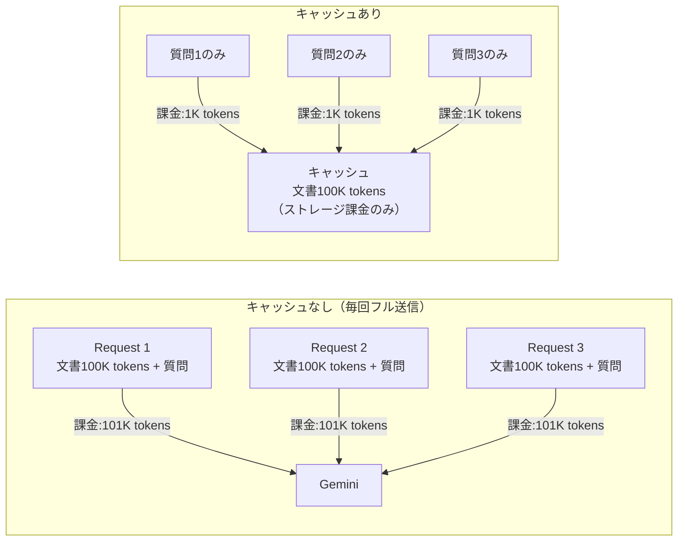
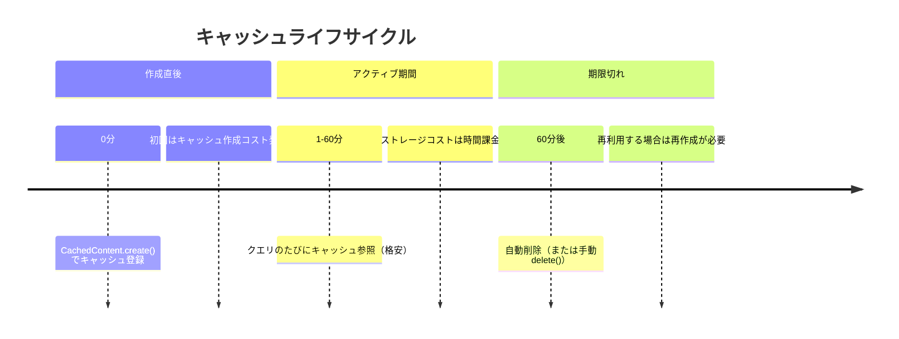

# Context Caching（コンテキストキャッシュによるコスト最適化）

## なぜ Context Caching が必要なのか？

Gemini の大きなコンテキストウィンドウ（最大 2M tokens）は強力だが、
**リクエストのたびに同じ大量テキストを送ると入力トークンコストが膨大になる**。
Context Caching は「変わらない部分を1度キャッシュし、リクエストで参照するだけ」にする仕組み。

| 設計判断 | 理由 |
|---------|------|
| **キャッシュは最低 32K tokens** | 短いコンテキストではキャッシュのオーバーヘッドが割に合わないため |
| **TTL 制限あり（最大 1 時間）** | 無制限キャッシュはストレージコスト・データ保護の観点から制限 |
| **キャッシュはモデルバージョン固定** | モデル更新時にキャッシュの互換性が壊れないようにするため |

---

## コスト効果の仕組み



**節約効果の目安**: キャッシュされたトークンの入力コストは通常の **75% OFF**

---

## 基本実装

```python
import vertexai
from vertexai.generative_models import GenerativeModel, Part
from vertexai.preview.caching import CachedContent
import datetime

vertexai.init(project="my-project", location="us-central1")

# 1. 大きなドキュメントをキャッシュに登録
large_document = Part.from_uri(
    "gs://my-bucket/large-document.pdf",
    mime_type="application/pdf"
)

cached_content = CachedContent.create(
    model_name="gemini-2.0-flash-001",
    system_instruction="あなたは文書分析の専門家です。",
    contents=[large_document],
    ttl=datetime.timedelta(hours=1),  # 最大1時間
    display_name="large-doc-cache",
)

# 2. キャッシュを参照してモデルを作成
model = GenerativeModel.from_cached_content(cached_content)

# 3. 軽量なクエリだけを送る（ドキュメントは毎回送らない）
for question in ["この文書の要約は？", "第3章の主なポイントは？", "結論は？"]:
    response = model.generate_content(question)
    print(response.text)

# 4. 不要になったらキャッシュを削除
cached_content.delete()
```

---

## キャッシュ可能なコンテンツ

| コンテンツ種別 | サポート | 注意点 |
|-------------|---------|--------|
| テキスト | ✅ | 32K tokens 以上必要 |
| PDF（GCS） | ✅ | GCS URI で指定 |
| 動画（GCS） | ✅ | GCS URI で指定 |
| 画像 | ✅ | 複数画像も可 |
| インライン base64 | ✅ | 大きいファイルは GCS 推奨 |
| System Instruction | ✅ | キャッシュに含めることで固定 |

---

## TTL の設計指針



```python
# TTL の更新（期限を延長）
cached_content.update(ttl=datetime.timedelta(hours=1))

# 既存キャッシュの一覧取得
for cache in CachedContent.list():
    print(f"{cache.display_name}: expires {cache.expire_time}")
```

---

## 活用シナリオ

### 長大コードベースの分析

```python
# リポジトリ全体をキャッシュして複数の質問に答える
repo_files = [Part.from_text(read_file(f)) for f in repo_files]
cache = CachedContent.create(
    model_name="gemini-2.5-pro-preview-05-06",  # 2M token コンテキスト
    contents=repo_files,
    ttl=datetime.timedelta(minutes=30),
)
model = GenerativeModel.from_cached_content(cache)
# バグ調査・リファクタリング提案・テスト生成などを次々と質問
```

### マルチターン Q&A（法律文書・技術マニュアル）

- 同じ文書に対して多数のユーザーが異なる質問をする場合
- セッションをまたいで同じ文書を参照し続ける場合

---

## コスト計算の注意点

| 課金対象 | 単価（参考） |
|---------|------------|
| 通常入力トークン | 標準単価 |
| キャッシュヒット入力トークン | 標準の **25%** |
| キャッシュストレージ | 時間あたり（100万tokens/時間） |
| 出力トークン | 標準単価（キャッシュ関係なし） |

**注意**: キャッシュは TTL 中ずっとストレージ課金が発生する。
1回しか使わないなら通常送信の方が安い場合もある。
