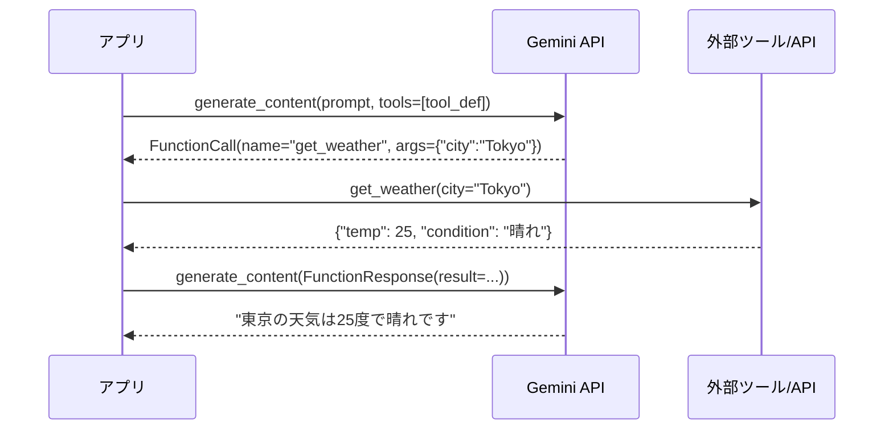
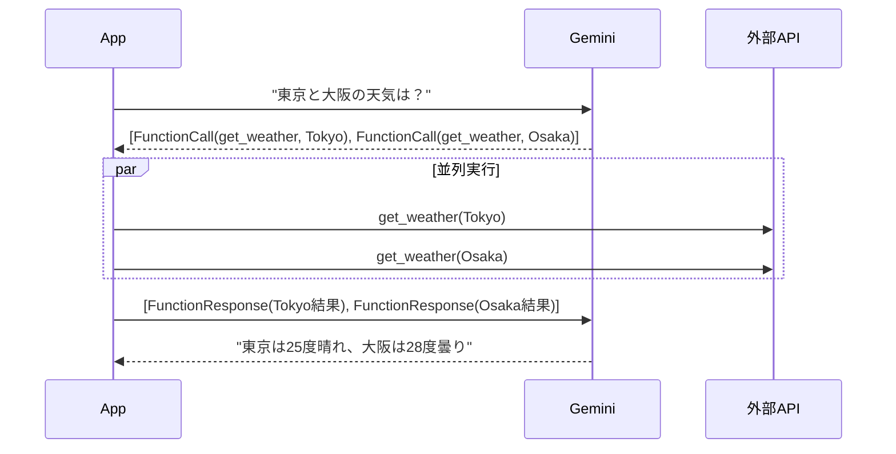
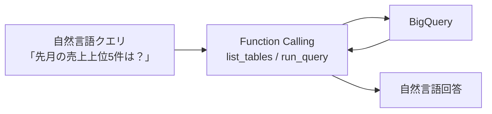

# Function Calling（ツール連携の仕組み）

## なぜ Function Calling が必要なのか？

LLM は学習データ以外の情報（リアルタイムデータ・社内データ・外部 API）を知らない。
Function Calling は **「LLM が外部ツールを呼び出す意思決定だけを担い、実際の実行はコードが行う」**
という設計で、LLM の知識制限を突破しながらハルシネーションリスクを下げる。

| 設計判断 | 理由 |
|---------|------|
| **JSON Schema でツール定義** | LLM が理解できる構造化フォーマットで引数を生成させるため |
| **実行はユーザーコードに委ねる** | セキュリティ・認証・副作用の制御をアプリ側に置くため |
| **並列実行モードを提供** | 独立した複数ツールを逐次実行するとレイテンシが増大するため |

---

## Function Calling の全体フロー



---

## 基本実装パターン

```python
import vertexai
from vertexai.generative_models import GenerativeModel, FunctionDeclaration, Tool

# ツール定義（JSON Schema で引数を記述）
get_weather = FunctionDeclaration(
    name="get_weather",
    description="指定した都市の現在の天気を取得する",
    parameters={
        "type": "object",
        "properties": {
            "city": {"type": "string", "description": "都市名（例: Tokyo）"},
        },
        "required": ["city"],
    },
)

tool = Tool(function_declarations=[get_weather])
model = GenerativeModel("gemini-2.0-flash-001", tools=[tool])

# 1回目: Gemini がどのツールを呼ぶか決定
chat = model.start_chat()
response = chat.send_message("東京の天気は？")

# FunctionCall が返ってきたら実際に実行
fc = response.candidates[0].content.parts[0].function_call
if fc.name == "get_weather":
    result = call_weather_api(fc.args["city"])  # 実際の API 呼び出し

    # 2回目: ツール結果を Gemini に返す
    response = chat.send_message(
        Part.from_function_response(name="get_weather", response=result)
    )
```

---

## Function Calling のモード

| モード | 動作 | 指定方法 |
|-------|------|---------|
| `AUTO`（デフォルト） | Gemini がツール使用を判断 | `tool_config=None` |
| `ANY` | 必ずいずれかのツールを使用 | `mode=ToolConfig.FunctionCallingConfig.Mode.ANY` |
| `NONE` | ツールを使用しない | `mode=ToolConfig.FunctionCallingConfig.Mode.NONE` |

```python
from vertexai.generative_models import ToolConfig

# 強制的にツールを使わせる（Forced Function Calling）
tool_config = ToolConfig(
    function_calling_config=ToolConfig.FunctionCallingConfig(
        mode=ToolConfig.FunctionCallingConfig.Mode.ANY,
        allowed_function_names=["get_weather"],  # 特定ツールに絞ることも可
    )
)
response = model.generate_content(prompt, tool_config=tool_config)
```

---

## 並列 Function Calling

独立した複数ツールを1回のターンで同時実行できる。



```python
# 複数の FunctionCall が返ってきた場合の処理
parts = response.candidates[0].content.parts
function_calls = [p.function_call for p in parts if p.function_call]

# 並列実行（ThreadPoolExecutor などを使う）
results = {fc.name: execute_tool(fc) for fc in function_calls}

# まとめて返す
response_parts = [
    Part.from_function_response(name=fc.name, response=results[fc.name])
    for fc in function_calls
]
response = chat.send_message(response_parts)
```

---

## データ構造からの自動ツール生成

Python の型アノテーションから FunctionDeclaration を自動生成できる。

```python
from vertexai.generative_models import FunctionDeclaration

# Python 関数の docstring と型ヒントから自動生成
def get_product_info(product_id: str, include_reviews: bool = False) -> dict:
    """商品情報を取得する。
    
    Args:
        product_id: 商品 ID（例: "PROD-001"）
        include_reviews: レビューを含めるか
    """
    ...

# from_func は docstring を description として使用
tool_decl = FunctionDeclaration.from_func(get_product_info)
```

---

## SQL Talk パターン（DB × Function Calling）

`gemini/function-calling/sql-talk-app/` のパターン：
自然言語 → SQL 生成 → DB 実行 → 結果を自然言語で返す



このパターンの利点：
- LLM が直接 SQL を書かず、ツール経由でスキーマを確認してから生成するため精度が高い
- 任意の SQL 実行を防ぐため、許可クエリを `NONE` モードで制限できる
