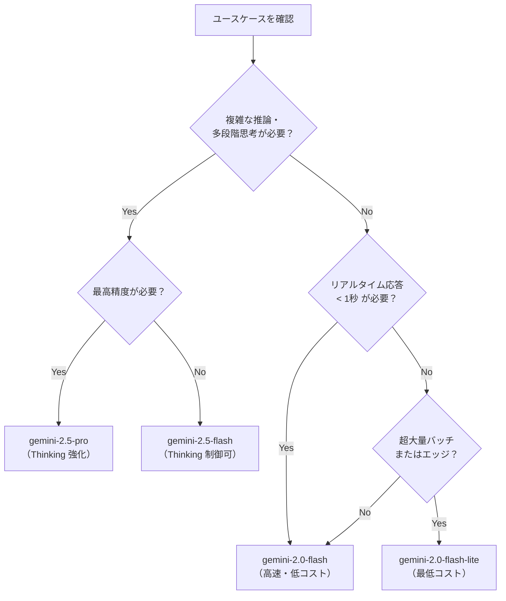

# Gemini モデル系列（Flash / Pro / Ultra の選び方）

## なぜモデルが複数存在するのか？

生成 AI のユースケースは **「速度×精度×コスト」** のトレードオフで決まる。
Google は用途ごとに最適なモデルを提供することで、
「高精度が必要な場合だけ高コストモデルを使う」という選択を可能にしている。

| 設計判断 | 理由 |
|---------|------|
| **Flash 系を先にリリース** | 利用者の大半は応答速度とコストを最重視するため |
| **Lite バリアントを追加** | エッジ・組み込み・超大量バッチ向けに更なるコスト削減が必要 |
| **Thinking を Pro に統合** | 複雑な推論タスクには内部思考プロセスが品質向上に直結するため |

---

## モデル比較表

| モデル ID | 速度 | 精度 | コスト | Thinking | コンテキスト |
|----------|------|------|--------|----------|------------|
| `gemini-2.0-flash` | ★★★ | ★★ | 低 | なし | 1M tokens |
| `gemini-2.0-flash-lite` | ★★★ | ★ | 最低 | なし | 1M tokens |
| `gemini-2.5-flash` | ★★★ | ★★★ | 中 | あり（制御可） | 1M tokens |
| `gemini-2.5-pro` | ★★ | ★★★★ | 高 | あり（強化） | 2M tokens |

---

## モデル選択フローチャート



---

## 各モデルの典型的なユースケース

### gemini-2.0-flash
```python
import vertexai
from vertexai.generative_models import GenerativeModel

vertexai.init(project="my-project", location="us-central1")
model = GenerativeModel("gemini-2.0-flash-001")

# チャットアシスタント・リアルタイム翻訳・要約など
response = model.generate_content("次のテキストを要約してください: ...")
```

### gemini-2.5-pro（Thinking 有効）
```python
model = GenerativeModel("gemini-2.5-pro-preview-05-06")

# 数学・コード生成・多段階推論タスク
response = model.generate_content(
    "この数学の問題を解いてください: ...",
    generation_config={"thinking_config": {"thinking_budget": 8192}}
)
# response.candidates[0].content.parts に思考過程が含まれる
```

---

## コンテキストウィンドウとトークン計算

| モデル | 入力上限 | 出力上限 | 特記 |
|-------|---------|---------|------|
| Flash 系 | 1,048,576 tokens | 8,192 tokens | 長文書処理に最適 |
| 2.5 Pro | 2,097,152 tokens | 65,536 tokens | 超長文・コードベース全体 |

**1トークンの目安:**
- 英語: 約 4 文字 = 1 token
- 日本語: 約 1-2 文字 = 1 token（文字数換算でコストが上がりやすい）

---

## モデルバージョン指定のベストプラクティス

```python
# 悪い例: latest は本番で予期しない挙動変化を招く
model = GenerativeModel("gemini-2.0-flash-latest")  # NG

# 良い例: 安定版には明示的なバージョンを指定
model = GenerativeModel("gemini-2.0-flash-001")      # OK

# 実験的機能を使う場合は preview を明示
model = GenerativeModel("gemini-2.5-pro-preview-05-06")  # OK（実験的）
```

---

## Gemini 3.x（次世代）

リポジトリの `gemini/getting-started/` に `intro_gemini_3_*.ipynb` が存在するが、
2025年5月時点では実験的。モデル ID・API は変更される可能性がある。

- `gemini-3-flash` — Flash 系の次世代
- `gemini-3-pro` — Pro 系の次世代
- `gemini-3-image-gen` — 画像生成特化（Imagen 統合）
