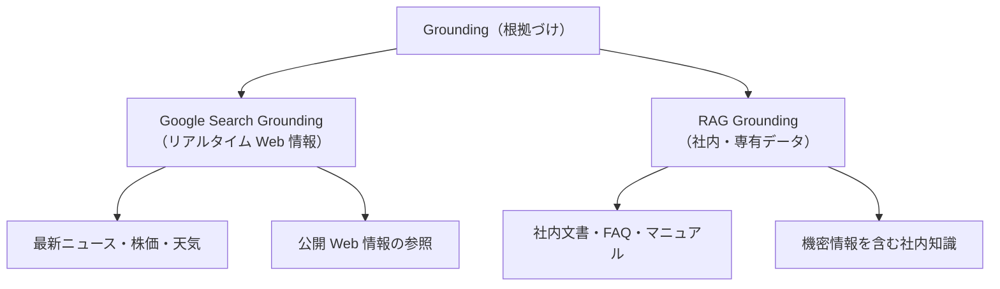
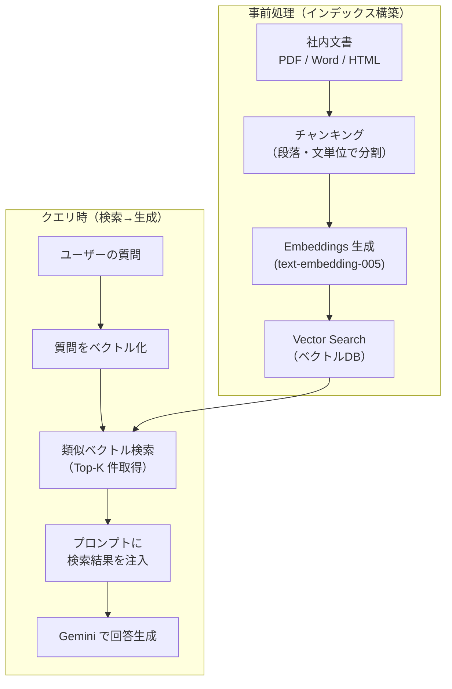

# Grounding & RAG（検索グラウンディングと検索拡張生成）

## なぜ Grounding が必要なのか？

Gemini の学習データには **カットオフ（知識の切れ目）** があり、
リアルタイム情報・社内専有情報は含まれていない。
Grounding は「LLM の回答を外部情報源に根拠づける」ことでハルシネーションを防ぐ。

| 設計判断 | 理由 |
|---------|------|
| **Google Search 統合を API レベルで提供** | ユーザーが検索ロジックを実装しなくて済むため |
| **RAG は Vector Search と統合** | 大規模な社内文書検索に本番品質のインフラが必要なため |
| **Grounding metadata を返す** | ユーザーが引用元を確認・表示できるように透明性を確保するため |

---

## Grounding の2種類



---

## Google Search Grounding

```python
import vertexai
from vertexai.generative_models import GenerativeModel, Tool, grounding

vertexai.init(project="my-project", location="us-central1")

# Google Search をツールとして有効化
model = GenerativeModel("gemini-2.0-flash-001")
google_search_tool = Tool.from_google_search_retrieval(
    grounding.GoogleSearchRetrieval()
)

response = model.generate_content(
    "2024年のノーベル物理学賞の受賞者は？",
    tools=[google_search_tool],
)

print(response.text)

# 引用元（グラウンディングメタデータ）の確認
grounding_metadata = response.candidates[0].grounding_metadata
for chunk in grounding_metadata.grounding_chunks:
    print(f"出典: {chunk.web.title} - {chunk.web.uri}")
```

---

## RAG の全体フロー



---

## Vertex AI RAG Engine（マネージド RAG）

```python
from vertexai.preview import rag
from vertexai.preview.generative_models import GenerativeModel, Tool

# 1. RAG コーパス（ベクトルDB）の作成
corpus = rag.create_corpus(display_name="company-docs")

# 2. ドキュメントのインポート
rag.import_files(
    corpus.name,
    ["gs://my-bucket/manual.pdf", "gs://my-bucket/faq.pdf"],
    chunk_size=512,       # チャンクサイズ（tokens）
    chunk_overlap=100,    # オーバーラップ
)

# 3. RAG ツールとして利用
rag_resource = rag.RagResource(rag_corpus=corpus.name, similarity_top_k=5)
rag_retrieval_tool = Tool.from_retrieval(
    retrieval=rag.Retrieval(source=rag.VertexRagStore(rag_resources=[rag_resource]))
)

model = GenerativeModel("gemini-2.0-flash-001", tools=[rag_retrieval_tool])
response = model.generate_content("製品の返品ポリシーは？")
print(response.text)
```

---

## Embeddings（テキストのベクトル化）

```python
from vertexai.language_models import TextEmbeddingModel

model = TextEmbeddingModel.from_pretrained("text-embedding-005")

# 単一テキストの埋め込み
embeddings = model.get_embeddings(["Gemini の使い方を教えてください"])
vector = embeddings[0].values  # 768次元のベクトル

# バッチ処理（大量ドキュメント）
texts = ["文書1...", "文書2...", "文書3..."]
batch_embeddings = model.get_embeddings(texts)
```

### Embeddings モデルの選択

| モデル | 次元数 | 用途 |
|-------|-------|------|
| `text-embedding-005` | 768 | 汎用（推奨） |
| `text-multilingual-embedding-002` | 768 | 多言語対応 |
| `textembedding-gecko` | 768 | レガシー（非推奨） |

---

## Grounding の引用メタデータを UI に表示する

```python
# グラウンディング結果に基づいてサポートされている文章の範囲を取得
supports = grounding_metadata.grounding_supports
for support in supports:
    # テキスト中のどの部分がどの引用元に支持されているか
    text_span = response.text[support.segment.start_index:support.segment.end_index]
    chunk_indices = support.grounding_chunk_indices
    confidence_scores = support.confidence_scores
    print(f'"{text_span}" → 信頼度: {confidence_scores[0]:.2f}')
```

---

## RAG vs Google Search Grounding の選択

| 観点 | Google Search | RAG |
|-----|--------------|-----|
| データソース | 公開 Web | 社内・専有データ |
| 鮮度 | リアルタイム | インポート時点 |
| セキュリティ | 公開情報のみ | VPC 内完結可 |
| セットアップ | ゼロ（API 有効化のみ） | コーパス構築が必要 |
| コスト | 検索クエリ課金 | ストレージ + 検索クエリ |
