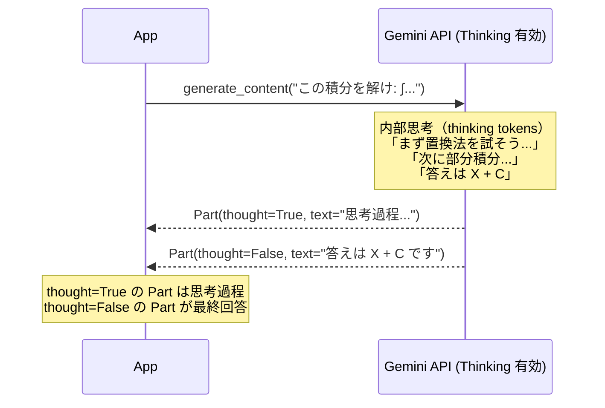
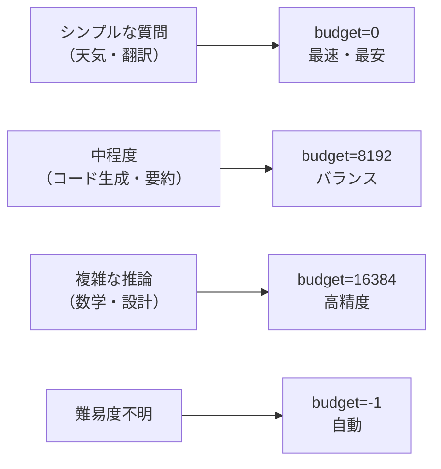

# Thinking モード（思考署名と推論強化）

## なぜ Thinking モードが必要なのか？

標準の LLM は入力を受け取ったらすぐ出力を始める（System 1 思考）。
数学・論理・複雑なコーディングは **「試行錯誤しながら段階的に考える」（System 2 思考）** が必要で、
Thinking モードは内部的に推論ステップを踏ませることで精度を高める。

| 設計判断 | 理由 |
|---------|------|
| **思考トークンを別 Part で返す** | ユーザーが思考過程を確認・デバッグできるようにするため |
| **thinking_budget で制御** | タスク複雑度に応じてコスト・速度を調整できるようにするため |
| **Flash にも Thinking を提供** | Pro ほどのコストをかけずに推論強化を実現するため |

---

## 思考署名（Thought Signatures）の仕組み



---

## 基本実装

```python
import vertexai
from vertexai.generative_models import GenerativeModel

vertexai.init(project="my-project", location="us-central1")

model = GenerativeModel("gemini-2.5-flash-preview-05-20")

response = model.generate_content(
    "次の数学の問題を解いてください: 方程式 x³ - 6x² + 11x - 6 = 0 の解は？",
    generation_config={
        "thinking_config": {
            "thinking_budget": 8192,  # 思考に使えるトークン数（0=無効, -1=自動）
        }
    },
)

# 思考過程と最終回答を分けて取得
for part in response.candidates[0].content.parts:
    if part.thought:
        print("【思考過程】")
        print(part.text)
    else:
        print("【最終回答】")
        print(part.text)
```

---

## thinking_budget の設定指針

| 値 | 動作 | 適用場面 |
|---|------|---------|
| `0` | Thinking 無効（通常モード） | シンプルな質問・会話 |
| `1024` | 最小限の思考 | 軽度の推論タスク |
| `8192` | 中程度の思考 | 数学・コード生成 |
| `16384` | 高度な思考 | 複雑な推論・競技プログラミング |
| `-1` | 自動調整（モデルが決定） | 難易度が不明なタスク |



---

## Thought Signatures（シリアライズ可能な思考）

マルチターン会話で思考を引き継ぐ機能。
LLM は前のターンの思考結果を「署名」として受け取り、再計算せずに継続できる。

```python
# REST API の場合（思考署名を含むレスポンス）
# {
#   "parts": [
#     {
#       "thought": true,
#       "text": "思考過程...",
#       "thoughtSignature": "BASE64_ENCODED_SIGNATURE"
#     },
#     {
#       "text": "最終回答"
#     }
#   ]
# }

# 次のターンで思考署名を送り返すと思考コストが削減される
# → gemini/thinking/intro_thought_signatures_rest.ipynb 参照
```

---

## Thinking モードが効果的なユースケース

### 数学・論理問題
```python
# 複雑な証明や計算
response = model.generate_content(
    "フィボナッチ数列の一般項を行列の累乗を使って導出してください",
    generation_config={"thinking_config": {"thinking_budget": 16384}},
)
```

### コード生成・デバッグ
```python
# 要件から複雑なアルゴリズムを実装
response = model.generate_content(
    "Dijkstra のアルゴリズムを Python で実装し、テストケースも書いてください",
    generation_config={"thinking_config": {"thinking_budget": 8192}},
)
```

### 多段階推論（エージェント内）
```python
# エージェントの各ステップで Thinking を使う
# → 計画フェーズだけ高い budget、実行フェーズは低くする
plan_response = model.generate_content(
    f"このタスクの実行計画を立ててください: {task}",
    generation_config={"thinking_config": {"thinking_budget": 8192}},
)
```

---

## Thinking モードのコスト

- 思考トークンも **入力トークンとして課金される**
- 思考過程が長いほどコストが増加するが精度も向上
- `thinking_budget` で上限を設定してコストを制御する

```python
# usage_metadata で思考トークン数を確認
usage = response.usage_metadata
print(f"プロンプトトークン: {usage.prompt_token_count}")
print(f"思考トークン: {usage.thoughts_token_count}")  # 思考トークン
print(f"出力トークン: {usage.candidates_token_count}")
```

---

## Thinking 対応モデル（2025年時点）

| モデル | Thinking | 思考品質 |
|-------|----------|---------|
| `gemini-2.5-flash-preview-*` | ✅ | ★★★ |
| `gemini-2.5-pro-preview-*` | ✅（強化） | ★★★★ |
| `gemini-2.0-flash-001` | ❌ | - |
| `gemini-2.0-flash-lite-001` | ❌ | - |
