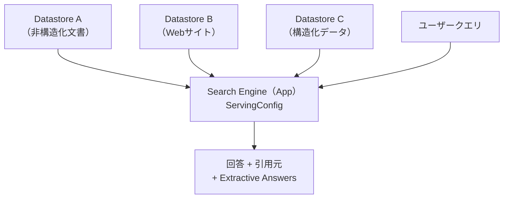
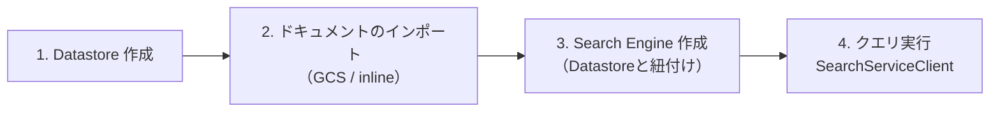

# Vertex AI Search（VAIS）

## なぜ Vertex AI Search が必要なのか？

Gemini の RAG Engine は汎用的なベクトル検索だが、Vertex AI Search (VAIS) は
Google の情報検索技術（深層IR・NLP・LLM）を組み合わせた **フルマネージドの企業向け検索プラットフォーム**。
社内文書・Webサイト・構造化データを横断する本番品質の検索エンジンをゼロから実装できる。

| 設計判断 | 理由 |
|---------|------|
| **Datastore と Engine を分離** | 複数のデータストアを1つの検索エンジンに束ねる「データブレンディング」を可能にするため |
| **discoveryengine API を使用** | VAIS の旧称「Discovery Engine」に由来。Python クライアントも `google-cloud-discoveryengine` |
| **Enterprise Tier が必要な機能がある** | Extractive Answers・LLM 要約は Enterprise Tier 以上でのみ利用可能 |

---

## コア概念



### Datastore（データストア）

データを保存・インデックス化する単位。作成時に種類を選択し、後から変更不可。

| 種類 | `contentConfig` | 用途 |
|-----|----------------|------|
| 非構造化（Unstructured） | `CONTENT_REQUIRED` | PDF・Word・HTML などのファイル |
| Webサイト | `PUBLIC_WEBSITE` | クロールで収集するWebページ |
| 構造化（Structured） | `NO_CONTENT` | BigQuery や JSON の構造化データ |

### Search Engine（検索アプリ）

1つ以上の Datastore に接続するエンドポイント。`solution_type=SOLUTION_TYPE_SEARCH`。
`ServingConfig` 経由でクエリを受け付ける。

---

## セットアップの全体フロー



---

## 基本実装（Python SDK）

```python
from google.api_core.client_options import ClientOptions
from google.cloud import discoveryengine

PROJECT_ID = "my-project"
LOCATION = "global"  # global / us / eu

client_options = (
    ClientOptions(api_endpoint=f"{LOCATION}-discoveryengine.googleapis.com")
    if LOCATION != "global" else None
)

# 1. Datastore 作成
ds_client = discoveryengine.DataStoreServiceClient(client_options=client_options)
data_store = discoveryengine.DataStore(
    display_name="my-docs",
    industry_vertical=discoveryengine.IndustryVertical.GENERIC,
    content_config=discoveryengine.DataStore.ContentConfig.CONTENT_REQUIRED,
)
ds_client.create_data_store(
    request=discoveryengine.CreateDataStoreRequest(
        parent=ds_client.collection_path(PROJECT_ID, LOCATION, "default_collection"),
        data_store=data_store,
        data_store_id="my-docs-id",
    )
)

# 2. GCS からドキュメントをインポート
doc_client = discoveryengine.DocumentServiceClient(client_options=client_options)
doc_client.import_documents(
    request=discoveryengine.ImportDocumentsRequest(
        parent=doc_client.branch_path(PROJECT_ID, LOCATION, "my-docs-id", "default_branch"),
        gcs_source=discoveryengine.GcsSource(
            input_uris=["gs://my-bucket/docs/*"],
            data_schema="content",
        ),
        reconciliation_mode=discoveryengine.ImportDocumentsRequest.ReconciliationMode.FULL,
    )
)

# 3. Enterprise Search Engine 作成（LLM 要約を有効化）
eng_client = discoveryengine.EngineServiceClient(client_options=client_options)
engine = discoveryengine.Engine(
    display_name="my-engine",
    solution_type=discoveryengine.SolutionType.SOLUTION_TYPE_SEARCH,
    industry_vertical=discoveryengine.IndustryVertical.GENERIC,
    data_store_ids=["my-docs-id"],
    search_engine_config=discoveryengine.Engine.SearchEngineConfig(
        search_tier=discoveryengine.SearchTier.SEARCH_TIER_ENTERPRISE,
        search_add_ons=[discoveryengine.SearchAddOn.SEARCH_ADD_ON_LLM],
    ),
)
eng_client.create_engine(
    request=discoveryengine.CreateEngineRequest(
        parent=eng_client.collection_path(PROJECT_ID, LOCATION, "default_collection"),
        engine=engine,
        engine_id="my-engine-id",
    )
)

# 4. クエリ実行
search_client = discoveryengine.SearchServiceClient(client_options=client_options)
serving_config = (
    f"projects/{PROJECT_ID}/locations/{LOCATION}/collections/default_collection"
    f"/engines/my-engine-id/servingConfigs/default_search"
)
response = search_client.search(
    discoveryengine.SearchRequest(
        serving_config=serving_config,
        query="CEOは誰ですか？",
        page_size=5,
        content_search_spec=discoveryengine.SearchRequest.ContentSearchSpec(
            summary_spec=discoveryengine.SearchRequest.ContentSearchSpec.SummarySpec(
                summary_result_count=5,
                include_citations=True,
            ),
            extractive_content_spec=discoveryengine.SearchRequest.ContentSearchSpec.ExtractiveContentSpec(
                max_extractive_answer_count=3,
            ),
        ),
    )
)
print(response.summary.summary_text)
```

---

## インラインインジェスト（GCS なし）

小規模文書や動的コンテンツは Base64 エンコードで直接送信できる。

```python
import base64, requests
from google.auth import default
from google.auth.transport.requests import AuthorizedSession

creds, _ = default()
session = AuthorizedSession(creds)

with open("doc.pdf", "rb") as f:
    content_b64 = base64.b64encode(f.read()).decode()

document = {
    "id": "doc-001",
    "structData": {"title": "製品マニュアル", "category": "tech"},
    "content": {"mimeType": "application/pdf", "rawBytes": content_b64},
}

session.post(
    f"https://discoveryengine.googleapis.com/v1/projects/{PROJECT_ID}"
    f"/locations/global/collections/default_collection"
    f"/dataStores/{DATASTORE_ID}/branches/default_branch/documents?documentId=doc-001",
    json=document,
)
```

---

## ドキュメント処理設定（パーシング＆チャンキング）

Datastore 作成時に `documentProcessingConfig` で指定する。

```python
# Layout Parser + チャンク500トークン（複雑なPDFに最適）
{
    "documentProcessingConfig": {
        "chunkingConfig": {
            "layoutBasedChunkingConfig": {
                "chunkSize": 500,
                "includeAncestorHeadings": True,  # 見出し情報をチャンクに付加
            }
        },
        "defaultParsingConfig": {"layoutParsingConfig": {}},
    }
}

# シンプルなデジタルPDF向け
{
    "documentProcessingConfig": {
        "defaultParsingConfig": {"digitalParsingConfig": {}}
    }
}
```

| パーサー | 用途 |
|---------|------|
| `layoutParsingConfig` | 表・リスト含む複雑なPDF（精度優先） |
| `digitalParsingConfig` | 標準的なデジタルPDF（速度優先） |
| `ocrParsingConfig` | スキャン文書（OCR） |

---

## フィルタリング・ブースティング・ファセット

REST API または Python SDK 両方で指定可能。クエリ時にリクエストボディで渡す。

### フィルタリング（検索対象を絞る）

```python
# メタデータベースのフィルタ
{
    "query": "おすすめ本",
    "filter": "rating_count>10 AND aggregate_rating>4.5 AND price=0",
}

# URLパターンフィルタ（Webサイト Datastore 向け）
{
    "query": "Books",
    "filter": 'siteSearch:"https://play.google.com/store/books/details/*"',
}
```

### ブースティング（ランキングを調整する）

ブースト値は `-1.0`（降格）〜 `+1.0`（昇格）。複数条件は加算される。

```python
{
    "query": "本を探す",
    "boostSpec": {
        "conditionBoostSpecs": {
            "condition": 'author: ANY("Margaret Atwood")',
            "boost": 0.9,
        }
    },
}

# 数値属性の区分線形ブースト（評価数に応じてブースト強度を変える）
{
    "boostSpec": {
        "conditionBoostSpecs": [
            {
                "condition": "rating_count>=10",
                "boostControlSpec": {
                    "attributeType": "NUMERICAL",
                    "interpolationType": "LINEAR",
                    "fieldName": "aggregate_rating",
                    "controlPoints": [
                        {"attributeValue": "0", "boostAmount": -0.5},
                        {"attributeValue": "3", "boostAmount": 0.0},
                        {"attributeValue": "5", "boostAmount": 0.8},
                    ],
                },
            }
        ]
    },
}
```

### ファセット（絞り込み UI 向け）

スキーマで `indexable: true, dynamicFacetable: true` にしたフィールドが対象。

```python
{
    "query": "本",
    "facetSpecs": [
        # 固定ファセット（常に先頭に表示）
        {"facetKey": {"key": "author"}, "limit": 5, "enableDynamicPosition": False},
        # 数値区間ファセット
        {
            "facetKey": {
                "key": "aggregate_rating",
                "intervals": [
                    {"minimum": 0, "maximum": 3},
                    {"minimum": 3, "maximum": 4.5},
                    {"minimum": 4.5, "maximum": 5},
                ],
            }
        },
    ],
}
```

---

## Gemini との統合パターン

### パターン1: VAIS を Grounding ツールとして使う（Gen AI SDK）

最もシンプル。Gemini が自動的に VAIS を検索して回答を生成する。

```python
from google import genai
from google.genai.types import GenerateContentConfig, Retrieval, Tool, VertexAISearch

client = genai.Client(vertexai=True, project=PROJECT_ID, location=LOCATION)

vais_tool = Tool(
    retrieval=Retrieval(
        vertex_ai_search=VertexAISearch(
            engine=f"projects/{PROJECT_ID}/locations/global/collections/default_collection/engines/{ENGINE_ID}",
        )
    )
)

response = client.models.generate_content(
    model="gemini-2.0-flash-001",
    contents="出張フライトの予約方法を教えてください",
    config=GenerateContentConfig(tools=[vais_tool]),
)
print(response.text)
```

### パターン2: 検索結果を Gemini に渡して要約（手動 RAG）

検索結果のスニペットを取得し、Gemini へのプロンプトに注入する。
データブレンディング（複数 Datastore の横断検索）に有効。

```python
# 1. VAIS から検索スニペットを取得
search_response = search_client.search(
    discoveryengine.SearchRequest(
        serving_config=serving_config,
        query=user_query,
        content_search_spec=discoveryengine.SearchRequest.ContentSearchSpec(
            snippet_spec=discoveryengine.SearchRequest.ContentSearchSpec.SnippetSpec(
                return_snippet=True,
            ),
        ),
    )
)

# 2. スニペットを抽出して Gemini へ
snippets = [r.document.derived_struct_data["snippets"][0]["snippet"]
            for r in search_response.results
            if "snippets" in r.document.derived_struct_data]
context = "\n".join(snippets)

from vertexai.generative_models import GenerativeModel
model = GenerativeModel("gemini-2.0-flash-001")
response = model.generate_content(
    f"以下の情報を参照して質問に答えてください:\n{context}\n\n質問: {user_query}"
)
```

---

## Gemini Enterprise

VAIS の Enterprise 向け拡張機能。`google-cloud-discoveryengine` の `ConversationalSearchServiceClient` を使う。

通常の Search API に加えて **AnswerQuery API**（会話型・マルチターン対応）を提供。

```python
from google.cloud import discoveryengine_v1 as discoveryengine

def get_answer(project_id, location, engine_id, query):
    client = discoveryengine.ConversationalSearchServiceClient()
    serving_config = (
        f"projects/{project_id}/locations/{location}/collections/default_collection"
        f"/engines/{engine_id}/servingConfigs/default_serving_config"
    )
    response = client.answer_query(
        request=discoveryengine.AnswerQueryRequest(
            serving_config=serving_config,
            query=discoveryengine.Query(text=query),
            answer_generation_spec=discoveryengine.AnswerQueryRequest.AnswerGenerationSpec(
                include_citations=True,
            ),
        )
    )
    return response.answer.answer_text
```

---

## Vertex AI RAG Engine との違い

| 観点 | Vertex AI Search (VAIS) | RAG Engine |
|-----|------------------------|------------|
| 用途 | 企業向け検索エンジン全体 | LLM 用 RAG パイプライン |
| データ | 非構造化・Web・構造化（横断） | 非構造化のみ |
| 検索品質 | Google 品質IR（ランキング・ブースト・ファセット） | ベクトル類似度検索 |
| UI 統合 | 検索UI向け機能（ファセット・スニペット） | プログラマティック |
| Gemini 連携 | Grounding Tool として直接利用可能 | RAG Resource として利用 |
| セットアップ | Agent Builder コンソール / API | Python SDK のみ |
| 向いている場面 | 社内ポータル・EC・ドキュメント検索サイト | チャットボット・QA システム |

---

## 主要リソース（このリポジトリ内）

| ファイル | 内容 |
|---------|------|
| `search/create_datastore_and_search.ipynb` | 基本セットアップ（作成〜クエリ）の入門 |
| `search/search_data_blending_with_gemini_summarization.ipynb` | 複数 Datastore 横断＋Gemini 要約 |
| `search/vertexai-search-options/vertexai_search_options.ipynb` | Search API と AnswerQuery API の比較 |
| `search/vais-building-blocks/ingesting_unstructured_documents_with_metadata.ipynb` | メタデータ付きインジェスト |
| `search/vais-building-blocks/inline_ingestion_of_documents.ipynb` | インラインインジェスト（GCS不要） |
| `search/vais-building-blocks/query_level_boosting_filtering_and_facets.ipynb` | ブースト・フィルタ・ファセット |
| `search/vais-building-blocks/parsing_and_chunking_with_BYO.ipynb` | パーシング・チャンキング設定 |
| `search/gemini-enterprise/intro_gemini_enterprise.ipynb` | Gemini Enterprise 入門 |
| `gemini/grounding/grounding_with_vais.ipynb` | Gen AI SDK での VAIS Grounding |
| `gemini/rag-engine/rag_engine_vertex_ai_search.ipynb` | RAG Engine + VAIS 統合 |
| `gemini/agent-engine/tutorial_vertex_ai_search_rag_agent.ipynb` | Agent Engine での RAG エージェント |
